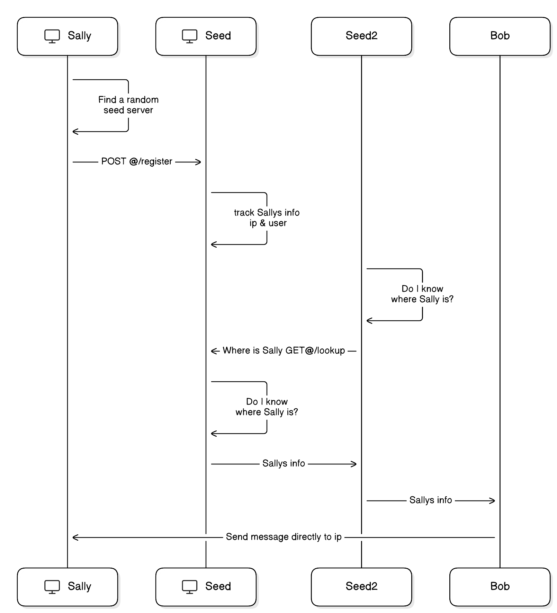

# Express P2P Network

A lightweight TypeScript/Express project for peer-to-peer messaging via a cluster of seed servers. Each client registers with a seed server, which tracks their username and URI. When one client wants to message another, the network performs a distributed lookup and delivers the message directly.



---

## Table of Contents

- [Features](#features)
- [Architecture & Flow](#architecture--flow)
- [Project Structure](#project-structure)
- [Getting Started](#getting-started)
  - [Prerequisites](#prerequisites)
  - [Installation](#installation)
  - [Configuration](#configuration)
  - [Running](#running)
- [API Routes](#api-routes)

---

## Features

- **Express-based**: Uses Express.js for HTTP routing.
- **Distributed lookup**: Peers query each other in a ring to find users.
- **Peer-to-peer**: Messages are sent directly between clients once located.
- **Trace logging**: API calls are logged to `trace.json` for debugging.

---

## Architecture & Flow

1. **Registration**
   - Clients `POST /register` with `{ user, uri }`.
   - Server stores `{ user, uri }` in memory.
2. **Lookup**
   - Client A `GET /lookup?user=B` on its seed server.
   - Seed server checks its cache; if missing, it forwards the lookup to other seeds via `lookupUser()`.
   - Prevents infinite loops using `x-request-id` and an internal set.
3. **Messaging**
   - Once URI is found, Client A `POST /send` with `{ to, message }`.
   - Server uses `sendMessage()` to deliver `{ from, message }` to the target’s `/message` endpoint.

---

## Project Structure

```text
Express-P2P-Network
├── assets/
│   └── diagram.png           # Sequence diagram
├── src/
│   ├── routes/
│   │   ├── lookup.ts         # Handles GET /lookup?user=
│   │   ├── register.ts       # Handles POST /register
│   │   ├── send.ts           # Handles POST /send
│   │   └── message.ts        # Handles POST /message
│   ├── appendEntryToJson.ts  # Logs entries to trace.json
│   ├── getCurrentUri.ts      # Get local server URI
│   ├── getRandomSeedServer.ts# Picks a random peer seed
│   ├── lookupUser.ts         # Peer-to-peer lookup helper
│   ├── registerWithSeedServer.ts # Forwards registration to peers
│   ├── sendMessage.ts        # Sends message payload via fetch
│   └── servers.ts            # In-memory seed registry
├── .gitignore
├── index.ts                  # Express app bootstrap
├── package.json
├── seed.ts                   # List of seed servers
├── tsconfig.json
└── yarn.lock
```

---

## Getting Started

### Prerequisites

- Node.js v14+  
- Yarn or npm

### Installation

```bash
git clone https://github.com/ptch05/Express-P2P-Network.git
cd Express-P2P-Network
yarn install     # or npm install
```

### Configuration

- **USER_NAME**: Unique identifier for this seed server/client.
- **PORT**: HTTP port (default `3000`).

### Running

```bash
USER_NAME=*insert username* PORT=*insert port* yarn dev
```

---

## API Routes

| Method | Path       | Body / Query                       | Description                              |
| ------ | ---------- | ---------------------------------- | ---------------------------------------- |
| POST   | `/register`| `{ user: string, uri: string }`    | Register this node in the cluster        |
| GET    | `/lookup`  | `?user=<username>`                 | Lookup user URI across all seeds         |
| POST   | `/send`    | `{ to: string, message: string }`   | Lookup & forward message to recipient    |
| POST   | `/message` | `{ from: string, message: string }` | Receive incoming message                 |

